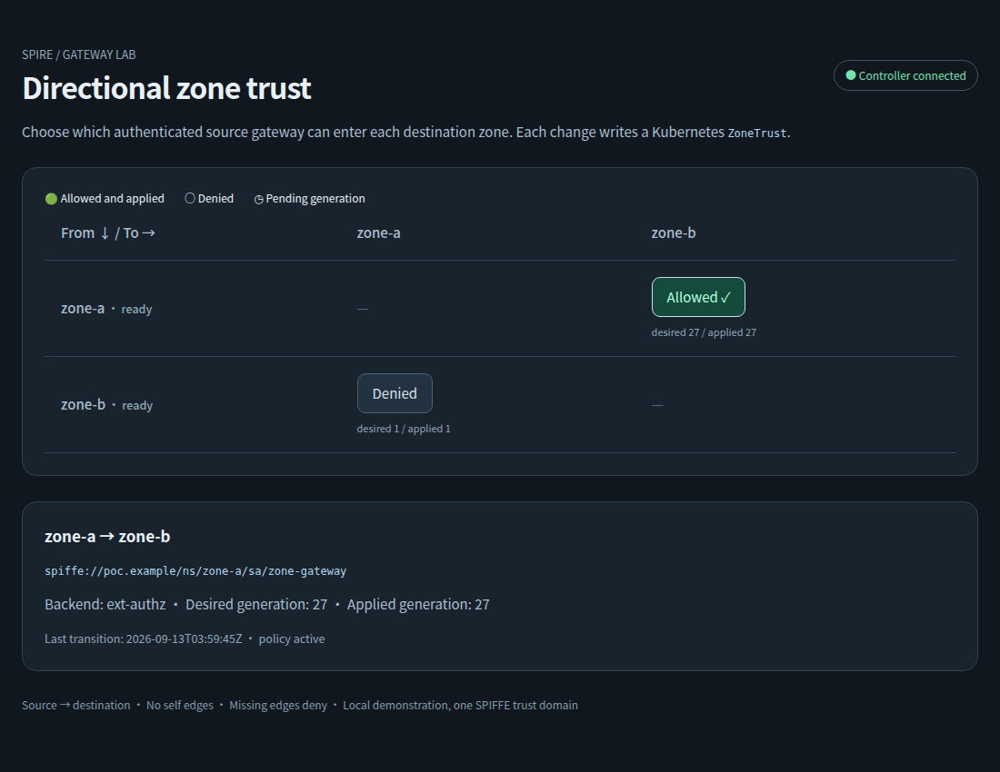

# SPIRE zone gateway POC

This POC compares two ways to enforce directional trust between zones through dedicated gateways.

- `standalone`: Envoy gets certificates through SPIRE Agent SDS and asks the controller to authorize each protected request.
- `istio`: Istio configures the gateways. The controller translates each `ZoneTrust` into an Istio `AuthorizationPolicy`.

Both modes use this request path:

```text
caller → source gateway ══ SPIRE mTLS ══ destination gateway → plain HTTP app
```

Apps have one container, no sidecar, no SPIFFE socket, and no certificate code. Cilium enforces NetworkPolicy so cross-zone callers cannot bypass the destination gateway.

## Run the POC

Prerequisites: Linux, Docker, Go 1.26, kubectl, Python 3 with PyYAML, curl, OpenSSL 3, GNU coreutils, Make, tar, and SHA-256 tools. Docker needs internet access to the image registries. The tool installer supports `amd64` and `arm64`.

```bash
make tools
make test
make bootstrap MODE=standalone
make e2e MODE=standalone
make dashboard MODE=standalone
```

Open `http://127.0.0.1:8080`. Select a source-to-destination cell to change its desired trust. The dashboard shows the desired and applied generations separately.



For Istio:

```bash
make bootstrap MODE=istio
make e2e MODE=istio
make dashboard MODE=istio
```

Each mode uses its own three-node cluster, named `spire-gw-standalone` or `spire-gw-istio`. Kubeconfigs live under `.state/<mode>/kubeconfig`. Commands do not change your default kubectl context. `KUBECONFIG` overrides the mode's kubeconfig when explicitly set. Bootstrap rejects an existing override with an unrelated current context. Use a new file or unset `KUBECONFIG`.

Allow several minutes for the first bootstrap to download images. Each cluster runs SPIRE Server, three Agents, CSI, Cilium, two apps, two gateways, and the controller. Istio mode also runs Istiod. See [test evidence](docs/test-evidence.md) for the tested host and measured results.

## Policy and inspection

An edge permits only its stated direction. An absent or deleted edge denies traffic.

```yaml
apiVersion: security.poc.example/v1alpha1
kind: ZoneTrust
metadata:
  name: zone-a-to-zone-b
spec:
  sourceZone: zone-a
  destinationZone: zone-b
  allowed: true
```

The dashboard writes this resource through the Kubernetes API. Its response reports acceptance. Applied status means the controller published the snapshot or observed the generated Istio policy. Istio traffic can converge after that status update through xDS. The e2e report measures both intervals.

```bash
KUBECONFIG="$PWD/.state/standalone/kubeconfig" kubectl get zonetrusts -o wide
KUBECONFIG="$PWD/.state/standalone/kubeconfig" kubectl get zonetrust zone-a-to-zone-b -o yaml
KUBECONFIG="$PWD/.state/standalone/kubeconfig" kubectl -n zone-a port-forward service/zone-gateway 18080:8080
# In another terminal:
curl http://127.0.0.1:18080/call/zone-b/demo
```

```bash
make inspect MODE=standalone
make inspect MODE=istio
KUBECONFIG="$PWD/.state/istio/kubeconfig" .tools/bin/istioctl proxy-status
KUBECONFIG="$PWD/.state/istio/kubeconfig" kubectl get authorizationpolicies -A
```

The gateway certificate identities are `spiffe://poc.example/ns/zone-a/sa/zone-gateway` and the corresponding `zone-b` URI. Istio policy principals omit `spiffe://`. Public certificate inspection never needs private key exports.

The SVID verifier checks the served public certificate chain against the SPIRE bundle and requires the exact gateway URI SAN. A matching CA serial alone does not establish issuer provenance.

## Versions

[versions.env](versions.env) is the source for tool and image pins. The original design's Kubernetes `v1.34.1` tag was unavailable. The implemented platform uses a published image and a compatible Cilium release.

| Component | Pin |
| --- | --- |
| SPIRE / hardened chart | `1.15.3` / `0.30.2` |
| SPIRE CRD chart | `0.6.1` |
| Standalone Envoy | `v1.39.1` |
| Istio | `1.31.0` |
| kind | `v0.33.0` |
| Kubernetes | `v1.34.11`, digest in `versions.env` |
| Cilium | `1.19.0` |

Istio uses its bundled Envoy build. The standalone Envoy pin does not replace Istio's proxy image. [Upstream research](docs/upstream-research.md) records the verified API details and compatibility sources.

## Troubleshooting

If a gateway remains pending, inspect its events with `kubectl -n zone-a describe pod <pod>`. A missing CSI driver or socket usually indicates an incomplete SPIRE installation.

If a gateway lacks an SVID, inspect `kubectl get clusterspiffeids zone-gateway -o yaml` and the SPIRE Server/controller-manager logs. The gateway needs its registration labels and `zone-gateway` service account.

If standalone calls return 503, inspect the controller's readiness and the destination gateway logs. Authorization service failures deny requests. An unavailable Kubernetes API also invalidates the controller snapshot.

If Istio does not converge, run `.tools/bin/istioctl analyze --all-namespaces` and `.tools/bin/istioctl proxy-status` with the mode's kubeconfig. Inspect the CSI mount on the regular `istio-proxy` container.

If nodes or Pods fail during bootstrap, inspect `docker stats` and `kubectl get events -A --sort-by=.lastTimestamp`. Image downloads, disk capacity, and Docker memory limits can delay startup. Re-run the same bootstrap after you correct the cause.

## Trade-offs and limits

| Property | Standalone | Istio |
| --- | --- | --- |
| Policy enforcement | HTTP ext-authz per protected request | Generated Envoy RBAC |
| Policy update path | Informer → snapshot | Informer → policy → Istiod → xDS |
| Controller outage | Protected requests fail closed | Last accepted proxy policy continues |
| Gateway configuration | Reviewed Envoy template | Gateway, VirtualService, DestinationRule |
| Operational cost | Smaller platform, custom request-path service | Additional Istiod control plane |

This is one kind cluster per mode and one SPIFFE trust domain. It does not demonstrate federation or production availability. Trust is at zone/service-account scope. The plain HTTP call entrypoint is a test harness, not end-user authentication.

Dashboard authentication is omitted for local use. Its Service is accessible through localhost port-forward. Only gateway Pods can reach the separate authorization Service through the declared NetworkPolicy.

Istio has an independent baseline policy that allows only port 8080. If the generated policy disappears, port 8443 denies requests after xDS convergence. The controller can recreate its policy but cannot modify the baseline. [ADR 0005](docs/adr/0005-independent-istio-baseline.md) describes the RBAC and admission boundary.

Istio uses one request per inter-gateway connection on port 8443. This avoids the inconsistent decisions observed with reused connections during rapid policy changes. It adds connection and TLS setup costs; see [the connection-lifetime decision](docs/adr/0004-bound-istio-gateway-connections.md).

The 120-second SVID lifetime supports a short functional rotation test. It is not a production rotation benchmark. Convergence measurements include the test harness and Kubernetes command overhead.

## Cleanup

```bash
make destroy MODE=standalone
make destroy MODE=istio
```

Cleanup deletes only the selected POC cluster. Local evidence remains under `.state/`.

[Architecture](docs/architecture.md) · [Implementation plan](docs/implementation-plan.md) · [Decisions](docs/adr/) · [Evidence](docs/test-evidence.md)

Apache-2.0. See [LICENSE](LICENSE).
